# Claude Science UI Forensics

Captured from the user-provided Claude Science localhost on July 30, 2026.
This is a visual and interaction audit of the running product, not a
reconstruction from marketing screenshots.

## The core correction

The current OpenScience redesign is too demonstrative. It uses a large hero,
large starter rows, multiple rounded containers, and an oversized persistent
composer to explain that a research session can begin.

Claude Science does almost none of that.

Its new-session state is an empty work surface with a small title and one
composer. Navigation and configuration stay quiet until invoked. Research
structure emerges from the work itself through messages, folded tool rows,
plans, files, and artifacts.

OpenScience should copy that information architecture and density, not just the
dark color palette.

## Structural model

```text
Desktop

┌──────────────┬──────────────────────────────────────────────────────────┐
│ project      │ active session tab                                       │
│              │                                                          │
│ + New        │                                                          │
│ Search       │                    work stream                           │
│ Customize    │                                                          │
│ Files        │                                                          │
│ Compute      │                                                          │
│              │                                                          │
│ sessions     │       ┌──────────────────────────────────────────┐       │
│              │       │ composer                                 │       │
│              │       │ +  options                model      mic │       │
│ settings     │       └──────────────────────────────────────────┘       │
└──────────────┴──────────────────────────────────────────────────────────┘
```

```text
Desktop with invoked work

┌──────────────┬──────────────────────────────────────────────────────────┐
│ navigation   │ session stream                                           │
│              ├──────────────────────────────────────────────────────────┤
│ active Files │ Files | artifact.png | Compute                           │
│ or Compute   ├──────────────────────────────────────────────────────────┤
│              │ selected secondary work surface                          │
└──────────────┴──────────────────────────────────────────────────────────┘
```

```text
Narrow screen

┌──────────────────────────────────────┐
│ menu  ← project         search files │
│ New session                         ×│
│                                      │
│                                      │
│                                      │
│  ┌────────────────────────────────┐  │
│  │ prompt                         │  │
│  │ +  options       model     mic │  │
│  └────────────────────────────────┘  │
└──────────────────────────────────────┘

Navigation becomes a left drawer. Broad configuration becomes a bottom sheet.
Small, contextual controls remain compact popovers.
```

## Scale system observed

### Typography

- Product and page chrome is visually around 15px.
- Session body copy is around 15px with a relaxed 22–24px line height.
- Secondary labels are around 13px.
- Metadata and timestamps are around 11–12px.
- Modal and sheet titles are around 18px.
- Major settings section headings are around 16px.
- The session does not use a display-size headline.
- Weight creates hierarchy more often than size.
- Monospace is reserved for code, paths, environment values, and identifiers.

### Spacing

- The base spatial rhythm is 4, 8, 12, 16, 24, and 32px.
- The app frame is inset about 8px on desktop.
- The composer is inset about 16px from the viewport bottom.
- Main chat content is held to a readable column instead of filling every
  available pixel.
- Message paragraphs use roughly 16–20px vertical separation.
- Dense navigation rows stay near 32–36px.
- Tool group headers stay near 40px.
- The UI reserves bottom space for the composer instead of allowing content to
  sit underneath it.

### Radii and borders

- App shell and utility panels: about 8px.
- Inline activity groups and compact popovers: about 10–12px.
- User message and composer: about 16px.
- Mobile sheets: about 20px on the top corners.
- Borders are one quiet tonal step above the surface.
- Shadows are largely reserved for floating menus, command search, and modal
  settings.
- There are no gradients and almost no decorative glow.

### Color behavior

- Canvas: near-black warm charcoal.
- Raised surface: a slightly lighter warm charcoal.
- Hover or selected surface: one further tonal step, not a new hue.
- Primary text: warm off-white.
- Secondary text: soft neutral gray.
- Borders: low-contrast warm gray.
- Blue is used sparingly for selection, focus, or linked artifacts.
- Warning color is isolated to actual warning notices.

## New session

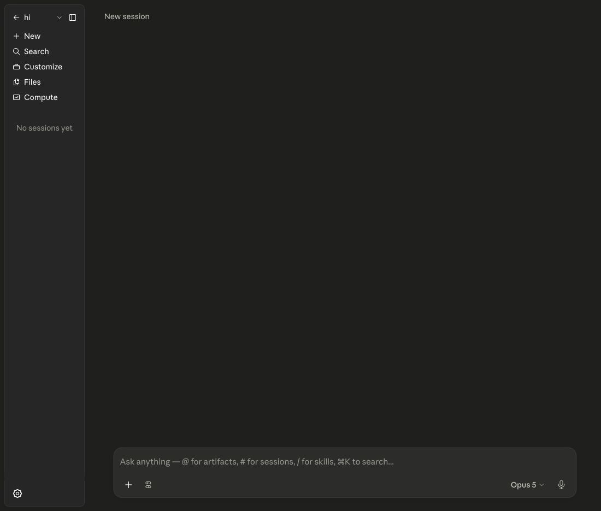

At 1100 × 935:

- The sidebar sits inside the viewport instead of owning a giant permanent
  application column.
- “New session” is a quiet 15px work-tab label near the top.
- The center is intentionally empty.
- The composer is about 848px wide and about 96–100px high.
- The composer has one outline, one fill, and one 16px radius.
- Prompt help lives in the placeholder, not in a hero or starter-card grid.
- The model is a quiet text control in the lower-right group.

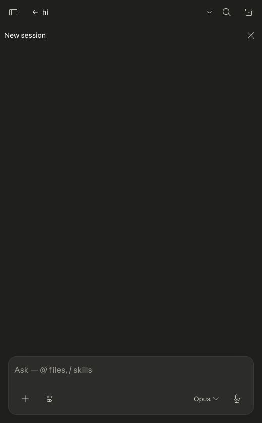

At 519 × 835:

- The full sidebar disappears.
- The header is roughly 48px high.
- The composer uses 16px side and bottom margins.
- The composer is about 117px high.
- There is no hero, onboarding panel, or starter catalog competing for space.

OpenScience correction:

- Remove the giant “What will you investigate?” presentation.
- Remove the three large default starter actions from the primary canvas.
- Move deep workflow discovery to search, commands, or a compact add menu.
- Keep only a quiet “New research” tab label and the composer.
- Reduce the composer from a promotional card to a working control.

## Project and session navigation

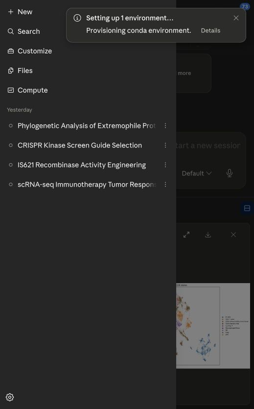

- On narrow screens, navigation is a 360px left drawer over a dimmed canvas.
- The drawer starts with five direct actions: New, Search, Customize, Files,
  and Compute.
- Sessions are plain one-line rows grouped by time.
- There are no descriptions under every navigation item.
- Selected state is a single dark fill.
- Settings is a lone icon anchored at the bottom.

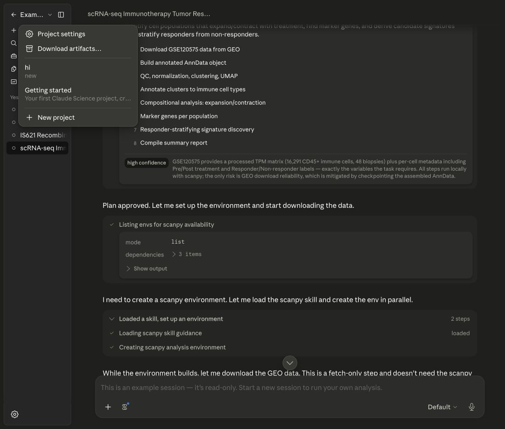

- Project switching is a compact popover attached to the project title.
- Project settings and artifact download are first-class actions.
- Other projects are simple rows, not cards.

OpenScience correction:

- Remove persistent explanatory subtitles from the main left rail.
- Use one-line actions with 14–15px labels.
- Keep shortcut hints only when they are genuinely useful.
- Reduce the desktop rail width and stop nesting labels, cards, and counters.
- Preserve the user-requested rule that contextual work opens only after a
  left-rail action.

## Session stream

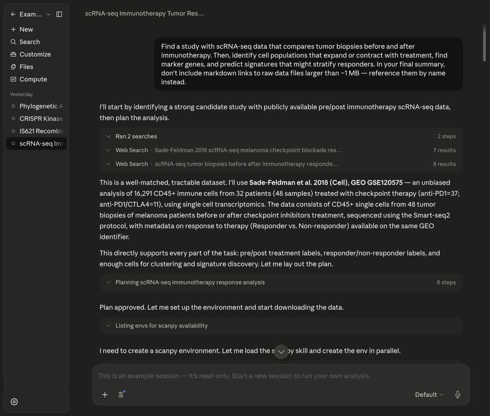

- User input is a restrained right-aligned bubble with a readable max width.
- Assistant text is mostly unboxed.
- The assistant column is about 800–820px at this viewport.
- Paragraphs are 15px, not oversized.
- Hierarchy comes from prose, strong text, and inline activity strips.

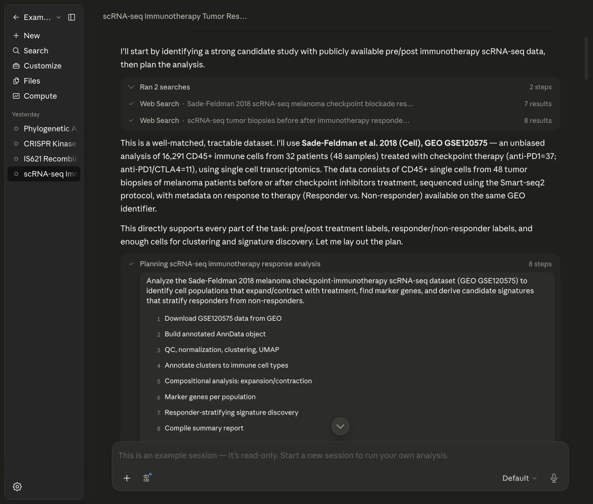

- A plan is one folded activity group.
- The collapsed header is about 40px.
- The expanded plan stays in the same surface.
- Steps are dense one-line rows, not individual cards.
- Confidence is a small footer treatment.

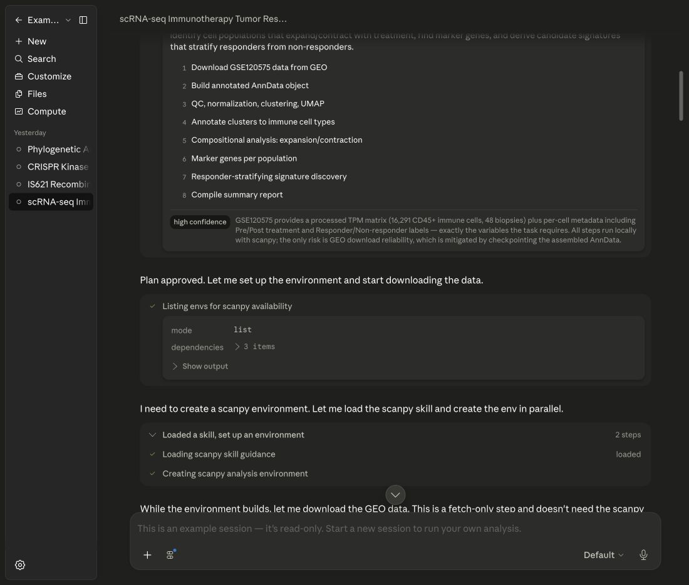

- Tool execution is represented by a quiet inline strip.
- Multiple related calls fold under one parent action.
- Expanded fields use compact key/value rows.
- Raw output is another disclosure, not a permanent console panel.
- Failures are kept in sequence rather than moved into a separate dashboard.

OpenScience correction:

- Stop giving every research object an independent rounded container.
- Use unboxed assistant prose.
- Fold related actions into one activity group.
- Keep plan rows, tool fields, logs, and provenance inside progressive
  disclosure.
- Do not use a persistent terminal-shaped surface for normal research work.

## Example Project end-to-end pass

The live Example Project is the clearest statement of the product model because
it contains a long scientific run, failures, generated files, a final report,
and enough open work to exercise the split layout.

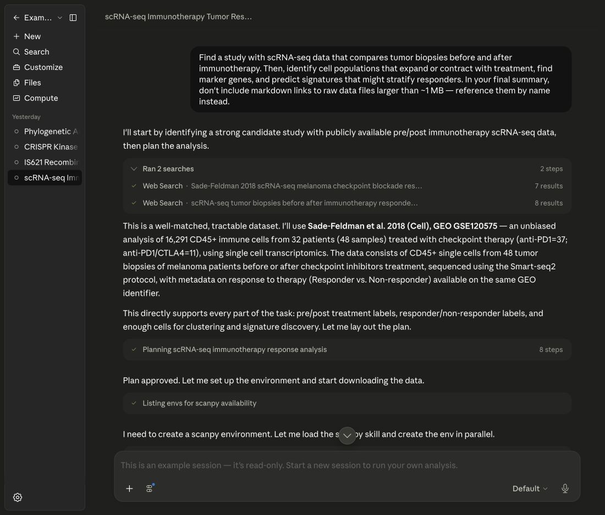

At the captured 1100 × 935 viewport:

- The entire application is inset by 8px.
- The project rail starts at x=8 and is 147px wide.
- The uninterrupted conversation surface starts at x=171 and is 921px wide.
- The single conversation tab row is 44px high.
- The rail project title uses 14px type.
- Direct rail actions are 28px high with 14px labels.
- Session rows are 24px high.
- The transcript column begins around x=223, leaving a 52px readable inset
  inside the work surface.
- Conversation text is 15px on an approximately 24px line height.
- The user request is the only prominent message bubble. Assistant prose stays
  unboxed.
- The composer remains docked while the transcript scrolls independently.

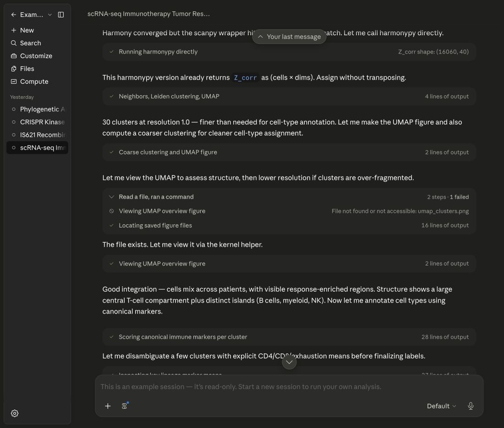

The middle of the run shows the normal execution rhythm:

- Assistant reasoning is short prose between action groups.
- Successful commands are one muted row with the result summary aligned right.
- Related actions fold under a single parent row.
- A failed file read stays in the chronological group next to the recovery
  command; it does not open an error dashboard.
- Long output is summarized as “n lines of output” until explicitly expanded.
- The “Your last message” marker and jump-to-current control float over the
  transcript without adding another navigation band.

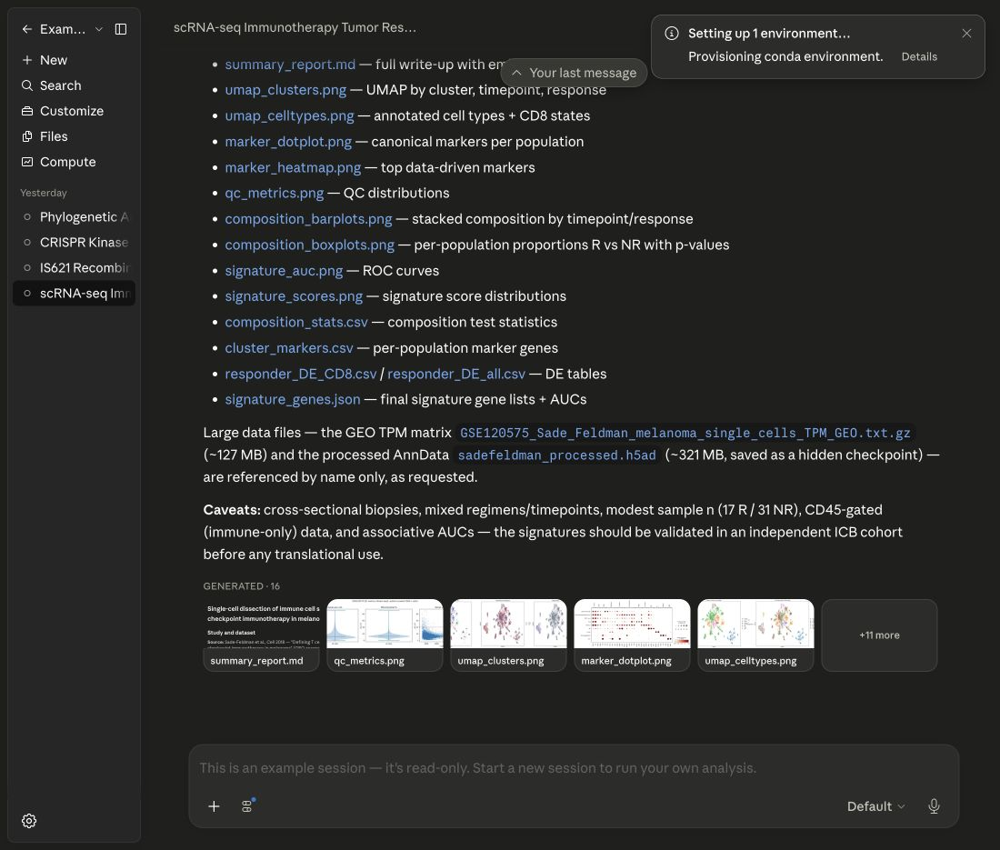

The result sequence is:

1. The final scientific synthesis remains ordinary readable prose.
2. Named files are inline controls inside that prose.
3. A `GENERATED · 16` label introduces a compact artifact strip.
4. Five representative artifacts are previewed.
5. The remaining eleven stay behind one `+11 more` control.
6. Composer, response feedback, and copying remain part of the conversation
   surface.

The generated strip is a result of the work, not a separate artifact dashboard.
This keeps the scientific conclusion visually primary and makes the files
available at the exact point where they become relevant.

### Invoked split geometry

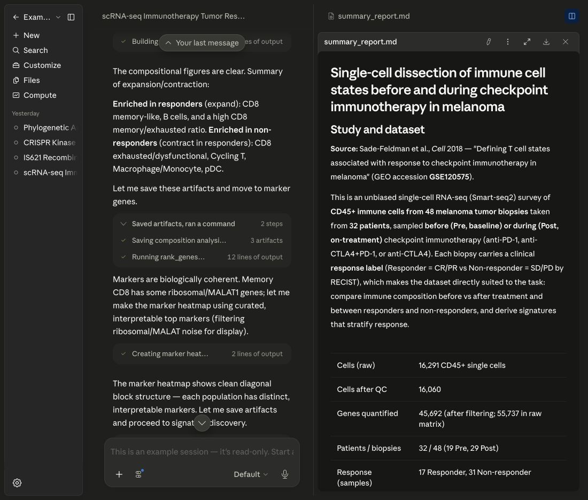

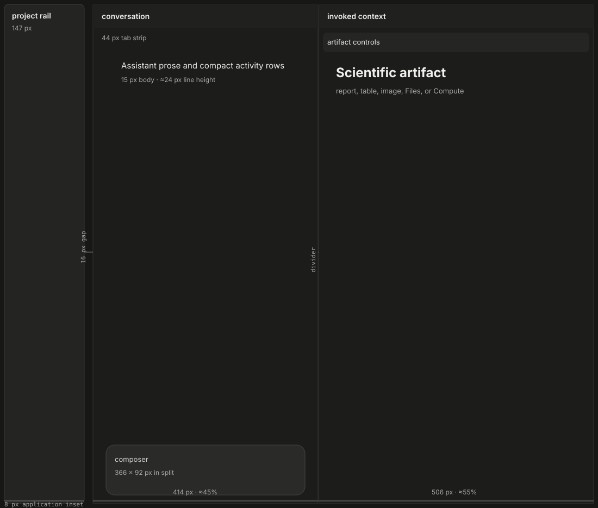

Opening `summary_report.md` changes the 921px work surface into two peers:

```text
x=171                       x=586                              x=1092
┌───────────────────────────┬────────────────────────────────────┐
│ conversation              │ summary_report.md                  │
│ 414px                     │ 506px                              │
│                           │                                    │
│ transcript                │ artifact toolbar                   │
│                           │ rendered scientific report         │
│ compact 366px composer    │                                    │
└───────────────────────────┴────────────────────────────────────┘
              approximately 45%                    approximately 55%
```

- The conversation remains mounted and keeps its exact scroll position.
- Each pane owns one 44px tab strip.
- The right pane receives more width because scientific documents, tables, and
  figures need it.
- The conversation composer shrinks with its pane instead of floating across
  the artifact.
- Artifact actions—edit, more, fullscreen, download, and close—stay in a
  second compact row inside the artifact pane.
- Closing the artifact removes the split completely. No collapsed right-side
  launcher remains.

This is the structural rule OpenScience should preserve: the right side is not
a permanent utility dock. It is a temporary peer workspace created by an
explicit action.

### Project-level Files

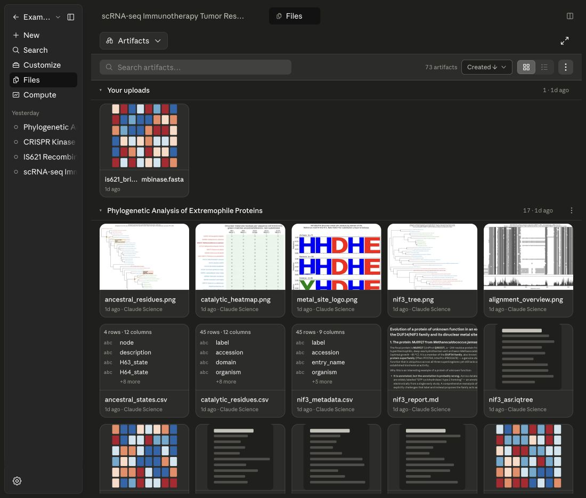

Files is organized as an artifact library, not as an exposed host filesystem:

- The default category is `Artifacts`.
- Search, count, sort, grid/list choice, and overflow actions stay in one
  shallow toolbar.
- Results are grouped by the session that produced them.
- Every group exposes its artifact count and relative creation time.
- Images render thumbnails.
- CSV files render row/column counts and sample field names.
- Markdown files render a content preview.
- Other scientific formats receive recognizable lightweight previews rather
  than generic empty tiles.
- Opening a file creates a split-view artifact tab; it does not navigate to an
  unrelated page.

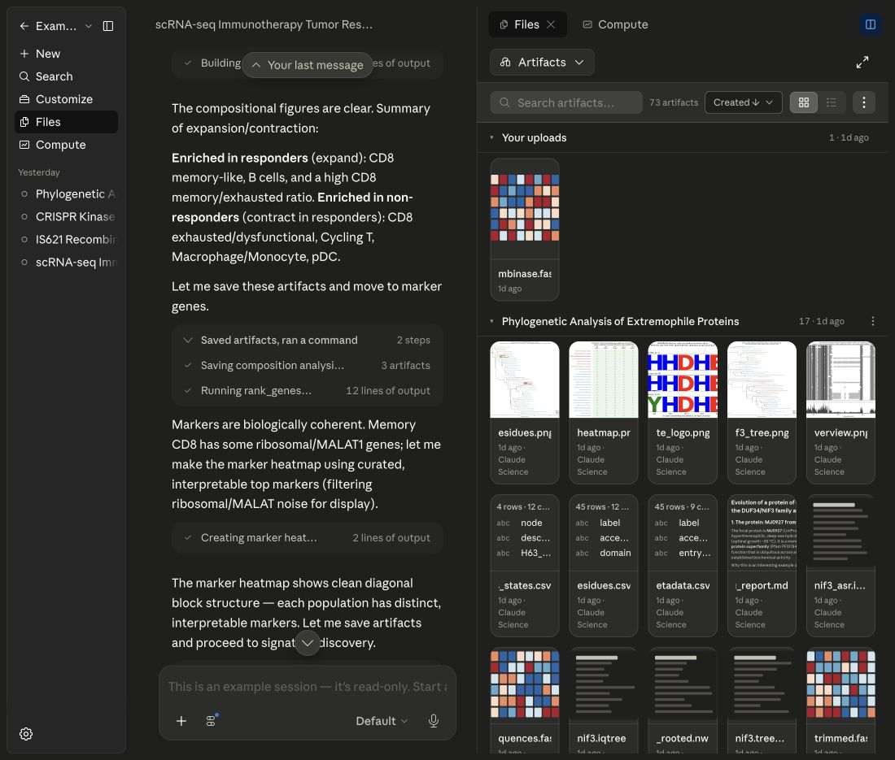

In a split, the same library responds to the 506px pane:

- Five compact preview columns remain visible.
- File metadata collapses before the preview itself becomes useless.
- The Files and Compute tabs coexist in the right pane after both have been
  invoked.
- The left rail continues to act as the launcher and selected-state indicator;
  it is not a second copy of the file controls.

This matters for the sandboxed Atlas design. Product-facing Files should mean
artifacts and workspace-visible outputs with provenance, not an assumption
that the agent owns an arbitrary folder on the host. A sandbox can expose its
approved workspace and generated artifacts through this library without
leaking the storage mechanism into the primary UI.

### Project-level Compute

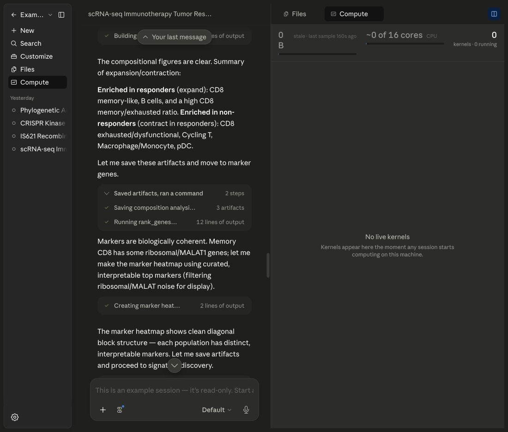

Compute uses the same right-pane tab system:

- A roughly 81px telemetry band reports memory, CPU, and kernel count.
- The rest of the surface is an unframed monitor.
- Empty state is two centered lines: state first, explanation second.
- Environment provisioning appears as a small top-right notification while
  work continues.
- There is no terminal launcher, server card, provider branding, or connection
  wizard in this surface.

### Project switcher and configuration

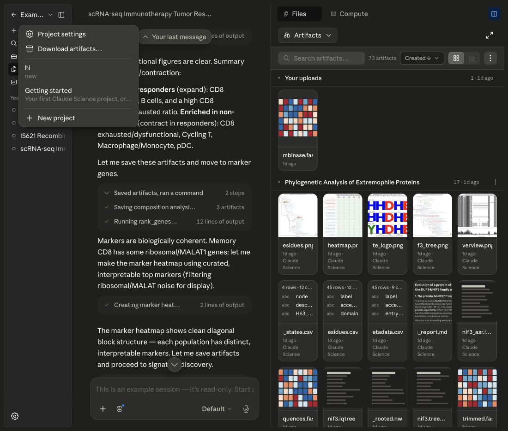

The project-title menu contains only project-level actions and destinations:
project settings, artifact download, recent projects, and new project.

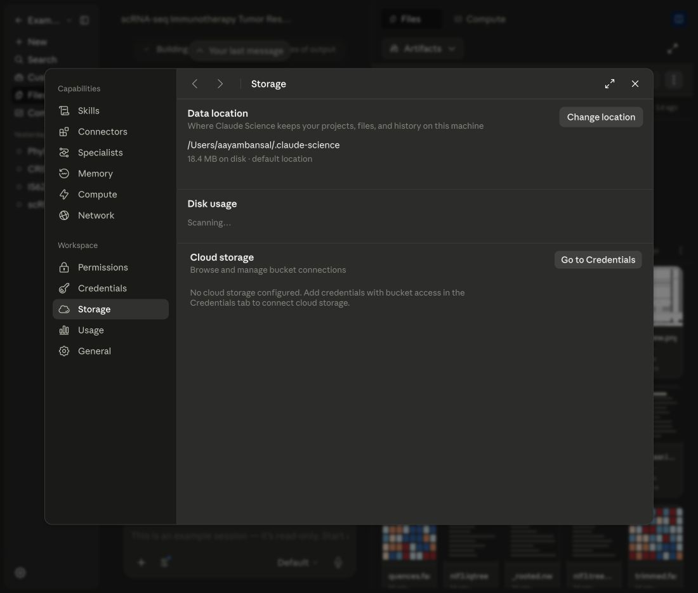

Customization opens the same broad settings modal used elsewhere. The modal
keeps capabilities—Skills, Connectors, Specialists, Memory, Compute, and
Network—separate from workspace concerns—Permissions, Credentials, Storage,
Usage, and General. Storage is explicitly presented as application-owned data,
which is compatible with moving execution into session sandboxes later.

### OpenScience structural implications

- Chat must remain the durable primary pane.
- Files, Atlas, Evidence, Compute, and artifacts should all be invoked context,
  never default columns.
- Invoked desktop context should stay near 400px by default, with user resizing
  available when a file or trace needs more room.
- Files should enter through the context pane rather than replacing the
  conversation.
- Context should use a real work-tab model so previously invoked Files and
  Compute surfaces can be revisited without duplicating them in the center
  strip.
- Artifact selection should preserve chat state and replace or extend the
  invoked context, not redirect the whole application.
- Sandboxed storage should surface through artifact/workspace semantics.
  Absolute host paths are implementation detail and should remain hidden.
- The renderer should prefer previews and provenance over raw folder chrome.

## Composer controls

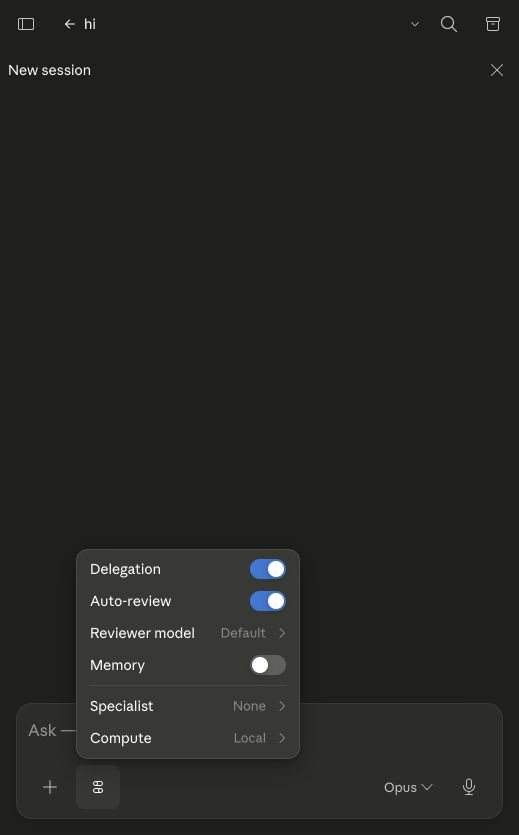

- Session options are a compact 224px popover above the composer.
- Rows are about 32px high.
- Current values are right-aligned.
- Secondary menus cascade only when a row is chosen.
- Compute selection belongs here because it is a run parameter.

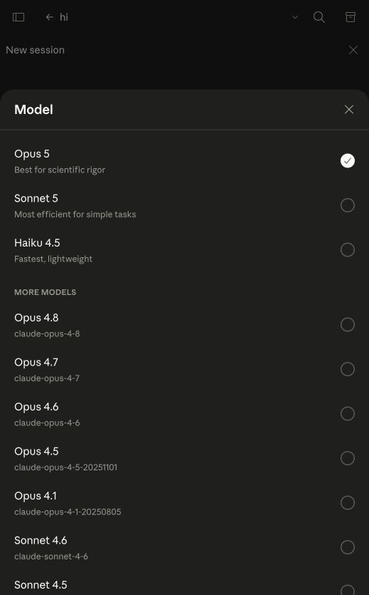

- Model choice becomes a bottom sheet on narrow screens.
- The sheet has one 18px title and one close action.
- Preferred models appear first with one-line explanations.
- Less common models are a simple continuation list.
- Selection uses a single radio/check indicator at the far right.

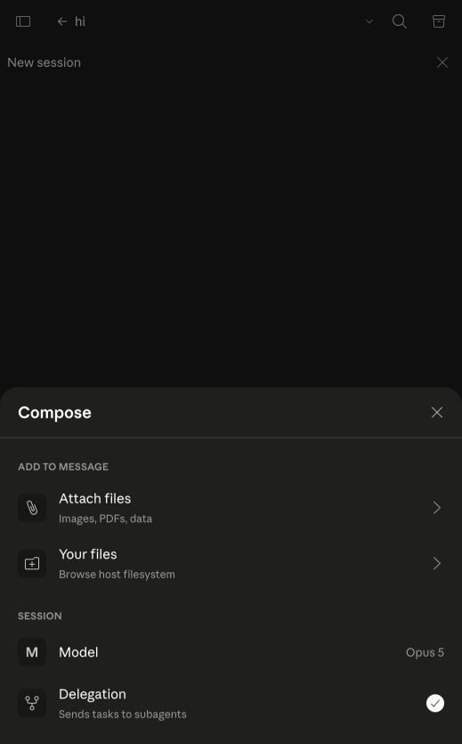

- Attachments, local files, model, and delegation live in one “Compose” sheet.
- This is where deeper options belong; they do not permanently widen the
  composer.

OpenScience correction:

- Keep the current provider-neutral model presentation.
- Reduce the desktop model menu and composer trigger to Claude-like density.
- Use a sheet below the narrow-screen breakpoint.
- Put advanced selection behind one row rather than displaying all controls.
- Keep Speed hidden when it has only one truthful value.

## Files and artifacts

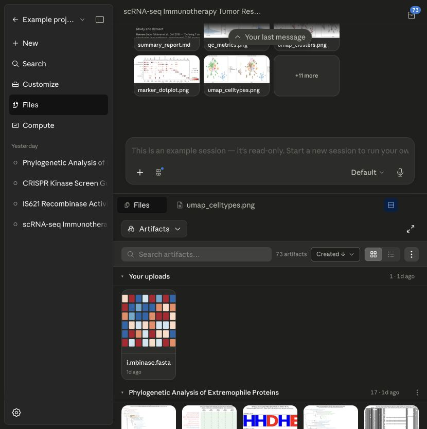

- Files opens only when requested.
- It is represented as a work tab and secondary surface, not a permanent rail.
- The toolbar is one compact 40px band.
- Search, sort, grid/list, and overflow controls share one line.
- Artifacts are grouped by their originating session.
- Image and data previews provide meaning before filenames.

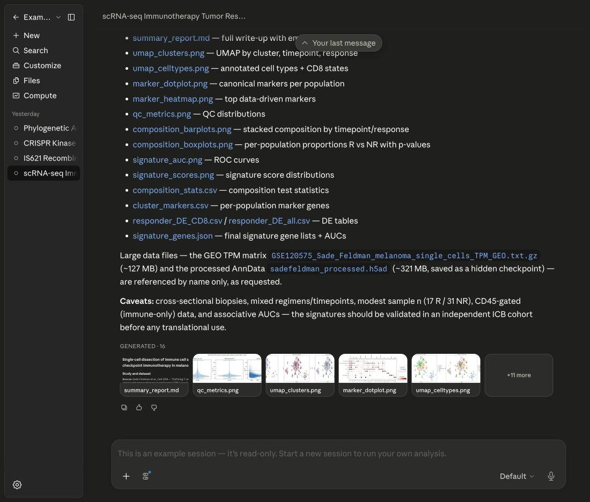

- Generated artifacts appear as a compact horizontal strip at the end of the
  answer.
- The first five are previewed; the rest collapse behind “+ more.”
- Opening an artifact creates an alongside work tab.
- Artifact controls stay in the artifact surface, not the conversation.

OpenScience correction:

- Keep the right/context surface closed until Files or an artifact is chosen.
- Make the initial Files state a dense browser, not nested empty cards.
- Treat artifact history, provenance, and review as inspector details after an
  artifact is selected.
- Reserve rich previews for actual scientific outputs.

## Compute

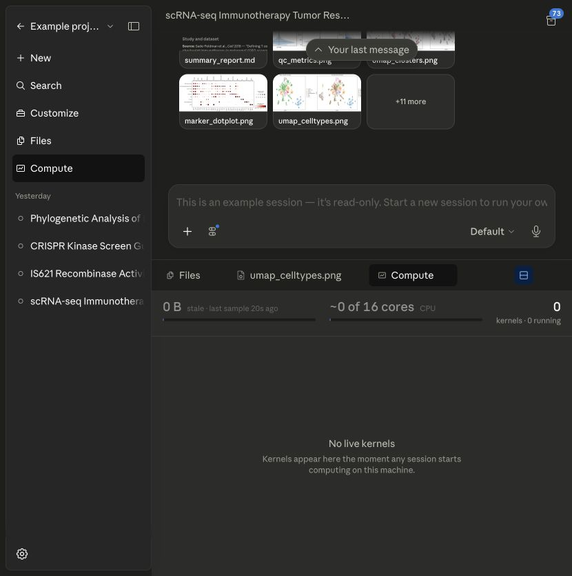

- Compute is another invoked work tab.
- The first row is a compact telemetry summary.
- Empty state is plain text centered in the remaining space.
- There is no large compute hero or stack of explanatory panels.
- Remote compute configuration lives in settings and the composer’s compute
  selector, not in the empty monitor.

OpenScience correction:

- Keep Kernels and Jobs honest, but reduce their framing.
- Put summary telemetry in one shallow band.
- Use one quiet empty state.
- Hide transport-specific configuration until the user asks to select or manage
  compute.

## Search

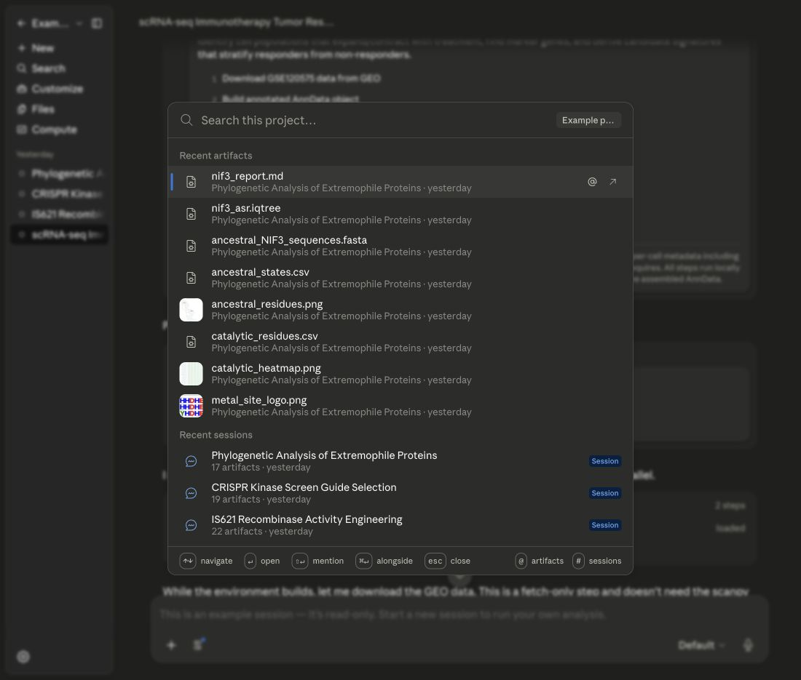

- Search is one centered palette around 640px wide.
- Results are grouped into artifacts, sessions, and commands.
- Each result is a single row.
- Keyboard instructions form one compact footer.
- The obscured application is dimmed and blurred.

OpenScience correction:

- Search should be the home for deep workflow discovery and cross-project
  retrieval.
- It should not become a dashboard of recommendation cards.

## Settings

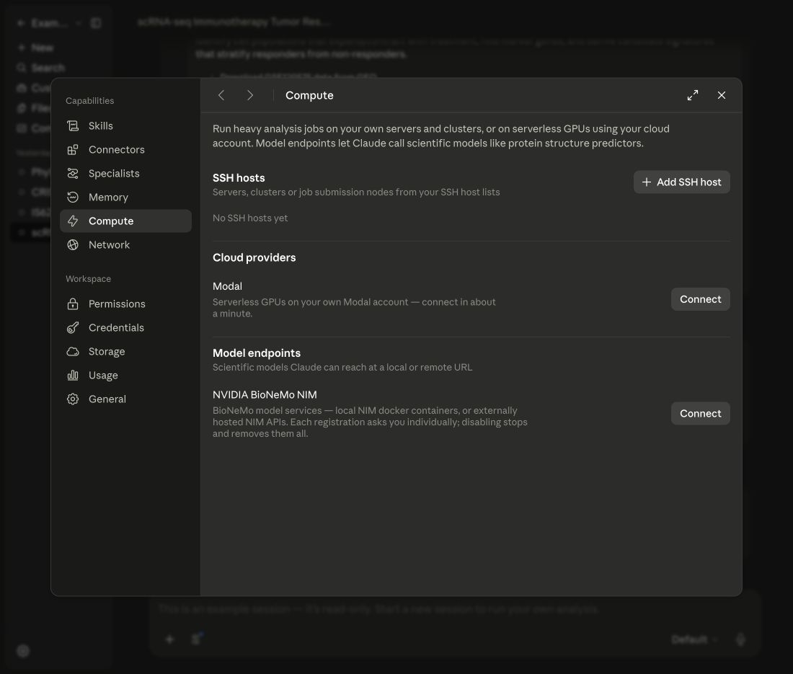

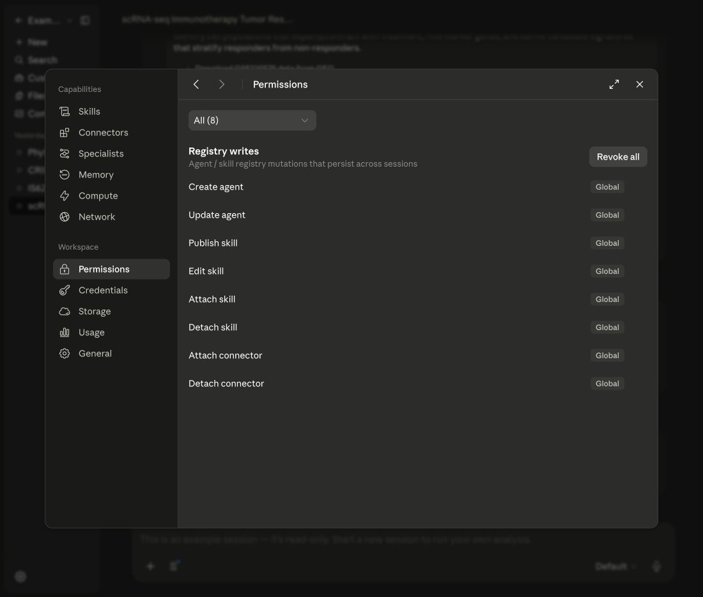

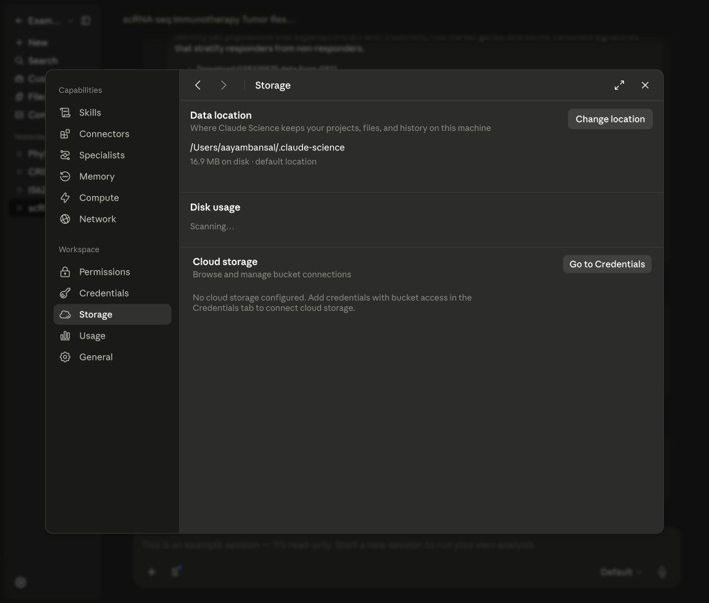

- Settings is a centered modal around 960 × 720 at the captured viewport.
- Its navigation column is about 208px.
- Navigation rows are about 34px.
- Content uses flat sections separated by rules.
- Capability settings and workspace settings are separate groups.
- Compute connections, permission history, credentials, storage, usage, and
  general settings each own one page.
- The storage page treats the application data root as a product-level setting.

OpenScience correction:

- Keep Memory present but untouched.
- Add future sandbox grants, workspace storage, compute connections, and
  credential management as flat settings pages.
- Do not expose provider routing or OpenRouter language.

## Required OpenScience reset

### Remove

- The display-size new-session headline.
- Default starter cards from the primary canvas.
- Oversized 18–20px body copy in operational surfaces.
- Repeated cards inside cards.
- Rounded backgrounds around every navigation and metadata group.
- Permanent helper descriptions under every rail action.
- Any content that can visibly pass under the fixed composer.

### Keep

- Söhne-first typography.
- Provider-neutral model selection.
- Left-owned access to contextual work.
- No terminal launcher.
- Files, Details, Atlas, Evidence, and Compute as invoked surfaces.
- Honest kernels/jobs/artifact/provenance behavior.

### Target

- 15px default body.
- 13px secondary text.
- 11–12px metadata.
- 16–18px surface titles.
- 32–36px rail rows.
- 40px tool and tab rows.
- 44px minimum primary touch targets where the whole row is not already the
  target.
- 8px shell radius.
- 10–12px inline group radius.
- 16px composer radius.
- 16px canvas inset.
- 800–850px readable session/composer width.

The desired result should feel like a scientific workbench that happens to be
beautiful. It should not look like a landing page placed inside an application.

## OpenScience implementation baseline

These captures were taken after applying the first structural correction pass.
They are checked into the branch so later UI changes can be compared against a
known rendered state instead of relying on memory.

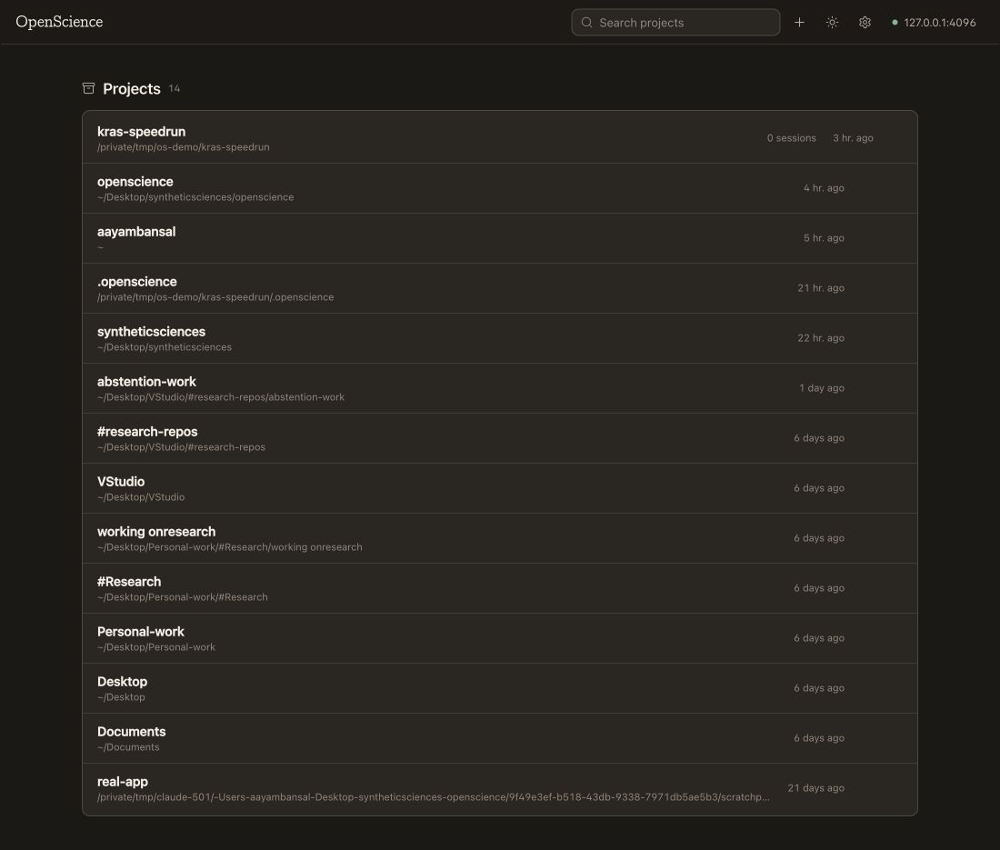

- The oversized project-launch hero is gone.
- Search, add, theme, settings, and server state live in one compact app bar.
- Projects use quiet 54px rows with activity and session metadata.
- The main surface now follows the same density as the research workbench.

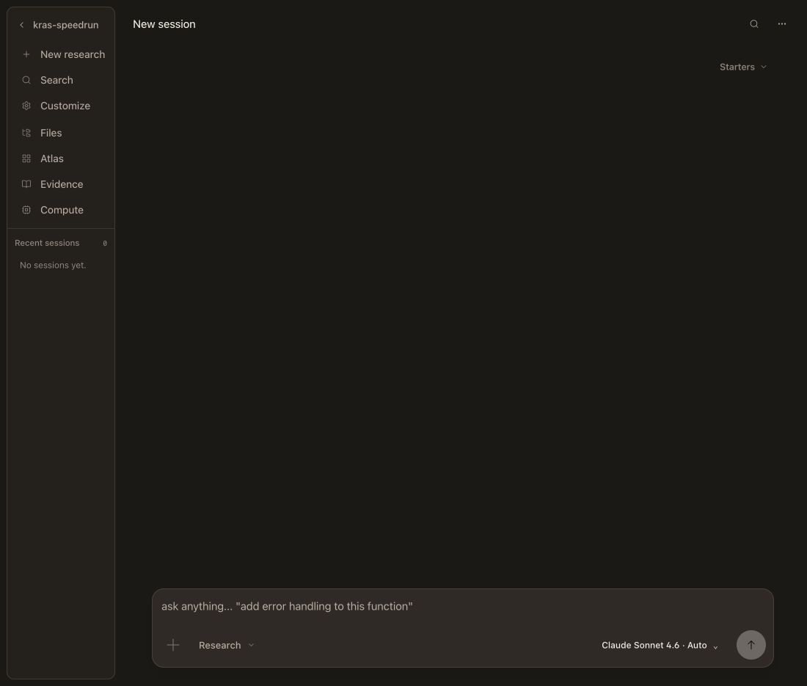

- The project rail now owns project navigation and is inset inside the frame.
- The main canvas has one 48px session-title bar.
- Chat does not render a second permanent work-tab row.
- The new-session canvas no longer contains a hero or default starter cards.
- The composer now follows the observed 848px, 16px-radius geometry.

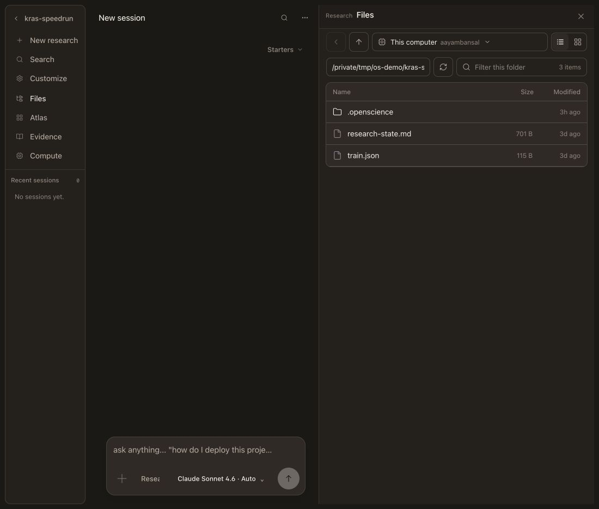

- Files remains absent until invoked from the left rail and now opens in the
  506px context pane without replacing the conversation.
- Three oversized toolbar bands were reduced to two compact rows.
- List rows and controls use the operational scale instead of card scale.
- The split uses the measured 414px conversation / 506px context geometry.

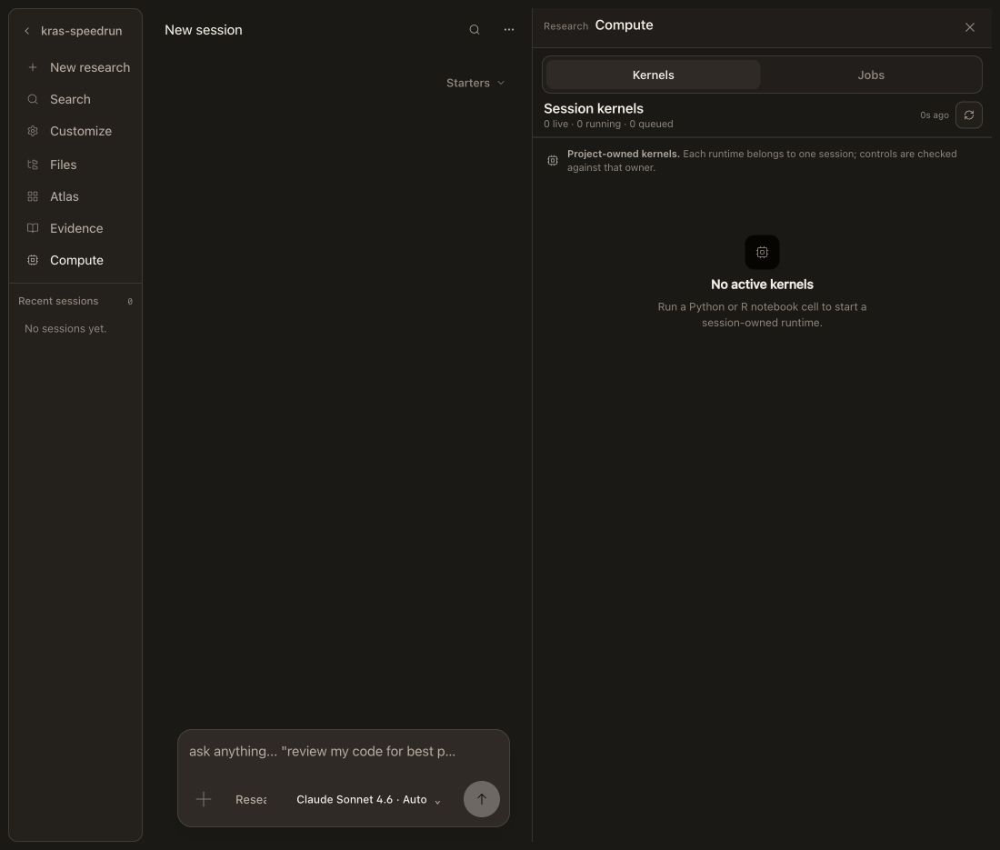

- Compute remains absent until invoked.
- The ownership explanation is an inline notice instead of a promotional card.
- Kernels and Jobs share a compact flat tab strip.
- Empty runtime state uses the remaining surface without nested framing.

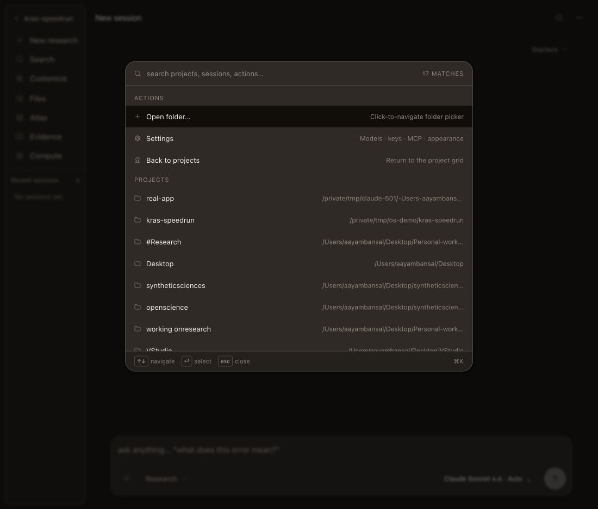

- The palette now uses the observed 640px desktop width.
- Result rows use 13px labels and 12px hints.
- Search remains the route into projects, settings, and broad discovery.

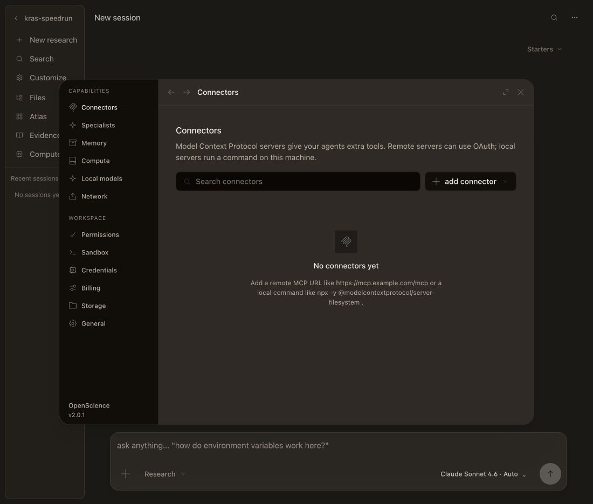

- Settings remains a dedicated modal with grouped navigation.
- Compute, Permissions, Sandbox, Credentials, and Storage remain explicit
  product surfaces.
- Memory is intentionally unchanged for the later Hermes/memory phase.

Mobile compose/model sheets, compact inline plans and tool calls, projects,
provider-neutral routing labels, and the invoked Files architecture were
completed after the first baseline. The shell-scale problem shown in the
original OpenScience screenshot is no longer the active design; the remaining
program is runtime integrity—session workspaces, fail-closed sandboxing,
persistent kernels, execution provenance, and owned compute jobs.

## July 31 implementation verification

A second live comparison covered the Claude Science dashboard, project session,
session options, model picker, customization modal, and connector directory.
The matching OpenScience surfaces were then checked in the development build at
the same 984 × 935 browser viewport.

The correction pass made these concrete changes:

- Replaced the composer’s unexplained dot-grid control with a named working-mode
  control that shows the active real agent and lets the user switch among the
  installed research specialists.
- Changed model selection from a nested “Model” row into a direct short list of
  real available models. Each row now shows only factual reasoning, context, and
  provider metadata, with the full catalog behind “More models.”
- Removed the borders and raised fill from the model trigger and reduced menu
  rows from 44px to 34px.
- Removed the full bordered user-message card, tightened turn spacing, hid the
  redundant “Response” label, and reduced tool execution to compact disclosure
  rows.
- Replaced the header’s ambiguous dots with a recognizable workspace-controls
  icon.
- Reduced the default inspector width from 506px to 400px and tightened Trace
  metrics and activity spacing.
- Widened the research rail from 156px to 180px so project and session names are
  readable without recreating a broad application sidebar.
- Removed internal project IDs from dashboard rows, reduced row height, and made
  “New project” an explicit labeled action.
- Replaced the connector empty state’s sample URL/command with two working entry
  points: “Add remote server” and “Add local command.” No catalog entries are
  fabricated when the backend has none.

The live screenshots used for this pass were captured locally before and after
each change. The lasting design rule is that operational controls must identify
their effect in the closed state; an unexplained ellipsis or dot grid is not an
acceptable substitute for model, agent, compute, or workspace state.
